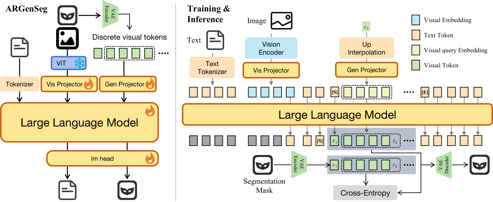

<h1 align="center"><strong>ARGenSeg: Image Segmentation with Autoregressive Image Generation Model</strong></h1>

<p align="center">
 <a href="https://arxiv.org/abs/2510.20803" target='_blank'>
 
 </a>
 <a href="https://arxiv.org/pdf/2510.20803.pdf" target='_blank'>
 
 </a>
 <a href="https://xlwangdev.github.io/ARGenSeg/" target='_blank'>
 
 </a>
  <a href="https://huggingface.co/inclusionAI/ARGenSeg-8B">
  
  </a>
</p>

<p align="center">
<a href="https://xlwang.site" target='_blank'>Xiaolong Wang</a><sup>1</sup> &nbsp;·&nbsp;
<a href="https://rulixiang.github.io/" target='_blank'>Lixiang Ru</a><sup>1</sup> &nbsp;·&nbsp;
<a href="https://huang-ziyuan.github.io/" target='_blank'>Ziyuan Huang</a><sup>1</sup> &nbsp;·&nbsp;
<a href="https://scholar.google.com/citations?user=PNTIf4gAAAAJ" target='_blank'>Kaixiang Ji</a><sup>1</sup><br>
<a href="https://openreview.net/profile?id=~DanDan_Zheng1" target='_blank'>Dandan Zheng</a><sup>1</sup> &nbsp;·&nbsp;
<a href="https://scholar.google.com/citations?user=8SCEv-YAAAAJ&hl=en" target='_blank'>Jingdong Chen</a><sup>1</sup> &nbsp;·&nbsp;
<a href="https://scholar.google.com/citations?user=mCVvloEAAAAJ&hl=en" target='_blank'>Jun Zhou</a><sup>1</sup>
</p>

<p align="center"><sup>1</sup>Ant Group &nbsp;·&nbsp; NeurIPS 2025</p>

## 🏠 About

<p align="center">

<p>

We propose a novel AutoRegressive Generation-based paradigm for image Segmentation (ARGenSeg), **achieving multimodal understanding and pixel-level perception within a unified framework.** Prior works integrating image segmentation into multimodal large language models (MLLMs) typically employ either boundary points representation or dedicated segmentation heads. These methods rely on discrete representations or semantic prompts fed into task-specific decoders, which limits the ability of the MLLM to capture fine-grained visual details. To address these challenges, we introduce **a segmentation framework for MLLM based on image generation**, which naturally produces dense masks for target objects. We leverage MLLM to output visual tokens and detokenize them into images using an universal VQ-VAE, making the segmentation fully dependent on the pixel-level understanding of the MLLM. To reduce inference latency, we **employ a next-scale-prediction strategy to generate required visual tokens in parallel**. Extensive experiments demonstrate that our method surpasses prior state-of-the-art approaches on multiple segmentation datasets with a remarkable boost in inference speed, while maintaining strong understanding capabilities. Key Innovations:

- Novel Framework: First segmentation paradigm built on a unified multimodal understanding-generation architecture, eliminating task-specific modules.
- SOTA without Extra Heads: Demonstrates unified MLLMs achieve state-of-the-art segmentation without dedicated segmentation heads.
- Efficiency & Robustness: Proposes next-scale prediction to accelerate inference; reveals coarse-to-fine mask generation inherently enhances robustness.

In this codebase, we release:

- ARGenSeg-8B checkpoint
- Training, evaluation, and inference code

## 🔥 News

- [2026-05-15] We release the inference code, training code, and [checkpoints](https://huggingface.co/inclusionAI/ARGenSeg-8B) for ARGenSeg.
- [2025-10-23] We release the [paper](https://arxiv.org/abs/2510.20803) on arXiv.
- [2025-09-18] ARGenSeg has been accepted by [NeurIPS 2025](https://neurips.cc/virtual/2025/loc/san-diego/poster/115738)! 🔥🔥🔥

---

## 📦 Installation

### Step 1: Create Conda Environment
```bash
conda create -n argenseg python=3.10
conda activate argenseg
```

### Step 2: Install Dependencies
```bash
pip install -r requirements.txt
```

### Step 3: Install Flash Attention
```bash
wget https://github.com/Dao-AILab/flash-attention/releases/download/v2.5.7/flash_attn-2.5.7+cu122torch2.2cxx11abiFALSE-cp310-cp310-linux_x86_64.whl
pip install flash_attn-2.5.7+cu122torch2.2cxx11abiFALSE-cp310-cp310-linux_x86_64.whl
```

### Step 4: Download VAR Pretrained Weights
```bash
mkdir -p internvl/model/var_vae/pretrained_weights
wget -O internvl/model/var_vae/pretrained_weights/vae_ch160v4096z32.pth \
    https://huggingface.co/FoundationVision/var/resolve/main/vae_ch160v4096z32.pth
```

### Step 5: Download ARGenSeg Checkpoint
Download the checkpoint from [HuggingFace](https://huggingface.co/inclusionAI/ARGenSeg-8B) and extract it to `pretrained/InternVL2_5-ARGenSeg-8B/`.

---

## 🎮 Demo

### Referring Expression Segmentation
```bash
python demos/seg_demo.py
```

### Segmentation & Chat
```bash
python demos/seg_demo_chat.py
```

---

## 🏋️ Training

### Prepare Training Data

#### Understanding Data
Follow the [InternVL documentation](https://internvl.readthedocs.io/en/latest/internvl1.2/reproduce.html) for detailed download instructions.

Example meta_path: `example/internvl_1_2_finetune.json`

#### Segmentation Data
Follow the [PSALM Dataset Documentation](https://github.com/zamling/PSALM/blob/main/docs/DATASET.md) for data preparation.

Example annotation format: `example/anns/refcoco.jsonl`  
Example meta_path: `example/data_seg.json`

#### Mixed Training Data
Merge the understanding and segmentation JSON files for mixed training.

Example: `example/mix_seg_usd.json`

### Start Training

```bash
sh scripts/train_argenseg.sh
```

---

## 📊 Evaluation

Please refer to [eval/README.md](eval/README.md) for detailed evaluation instructions on:

- RefCOCO Series (comprehension & segmentation)
- VQA (TextVQA, VQAv2)
- POPE
- MMMU

---

## 🔗 Citation

If you find this work useful, please cite:

```bibtex
@article{wang2025argenseg,
  title={ARGenSeg: Image Segmentation with Autoregressive Image Generation Model},
  author={Wang, Xiaolong and Ru, Lixiang and Huang, Ziyuan and Ji, Kaixiang and Zheng, Dandan and Chen, Jingdong and Zhou, Jun},
  journal={arXiv preprint arXiv:2510.20803},
  year={2025}
}
```

---

## 👏 Acknowledgements

We sincerely thank the contributors of [InternVL](https://github.com/OpenGVLab/InternVL), [VAR](https://github.com/FoundationVision/VAR), and [PSALM](https://github.com/zamling/PSALM) for their foundational work and open-source spirit.

---

## 📄 License

This project is licensed under the MIT License - see the [MIT License](LICENSE) file for details.
